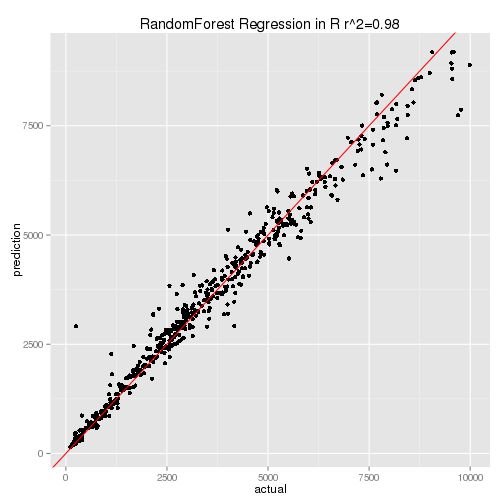

## Factors for pricing a Diamond     
      
1. Diamond price is determined by several factors.
2. Collected Daimond dataset from the website http://www.pricescope.com/ 
3. From the Dataset, we choose 6 predictors : Shape, Carat, Cut, Color, Clarity & Depth
4. The Target variable is diamond **Price**
5. We will predict daimond price on the basis of the values of 6 predictors.

--- .class #id 

## Working in R

```r
data <- read.csv("Diamond_price.csv", header=TRUE)   
mydata <- data[, c(1,2,3,4,5,7,10)]     
str(mydata)      
```

```
## 'data.frame':	1000 obs. of  7 variables:
##  $ Shape  : Factor w/ 10 levels "Asscher","Cushion",..: 4 4 4 4 4 4 4 4 4 4 ...
##  $ Carat  : num  3.13 1.03 1.02 1.63 1.2 1.5 1.71 2.04 2.04 1.67 ...
##  $ Cut    : Factor w/ 3 levels "Good","Ideal",..: 1 1 1 1 2 2 2 2 2 2 ...
##  $ Color  : Factor w/ 9 levels "D","E","F","G",..: 1 5 4 8 2 2 5 3 3 6 ...
##  $ Clarity: Factor w/ 9 levels "I1","I2","IF",..: 5 1 5 5 5 5 5 5 5 5 ...
##  $ Depth  : num  56.9 57.5 51.3 43 57.9 53 61.4 50.2 39.3 41.6 ...
##  $ Price  : Factor w/ 868 levels "$1,010","$1,036",..: 428 462 459 565 665 795 827 176 151 756 ...
```

--- .class #id 

## Analysis the Dataset

1. Random Forest model is used for diamond price prediction. Graph: Actual vs Predicted price.
 

--- .class #id 

## Shiny APP
    
     
1. [Here](https://anupb08.shinyapps.io/DataProducts) you find the App.
2. Select the value of different predictors and press "Submit" button
3. You will get the result at the right side.


